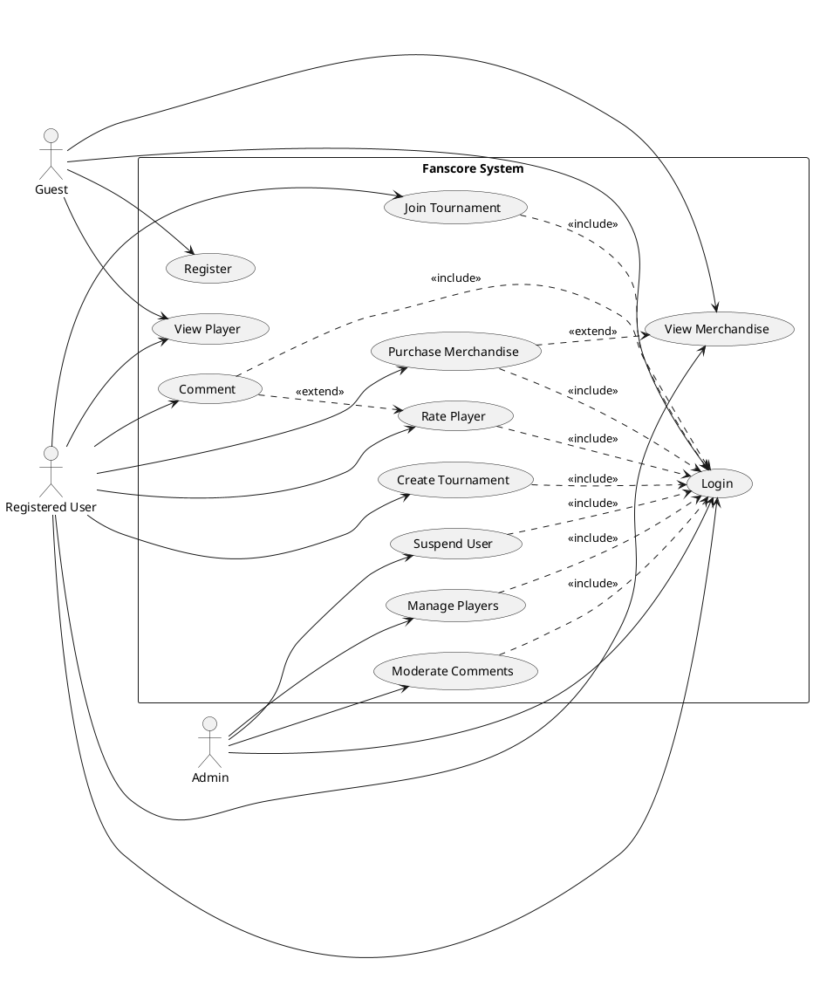
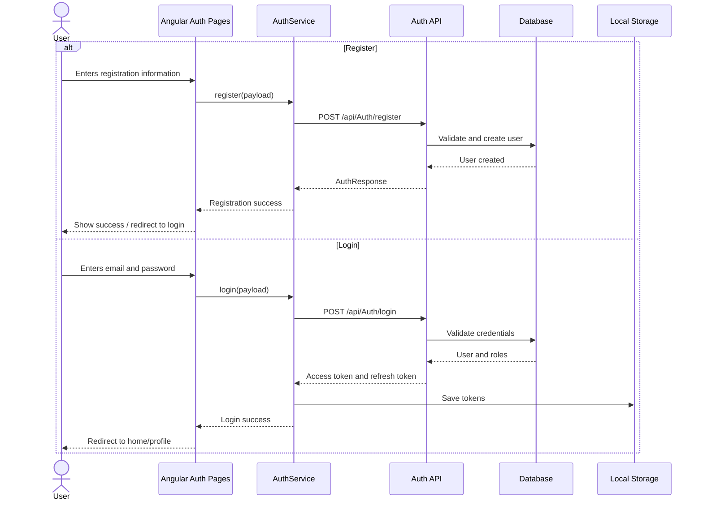
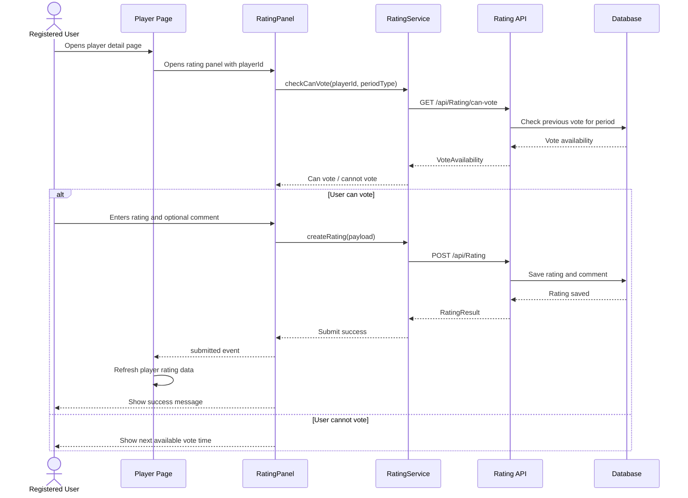
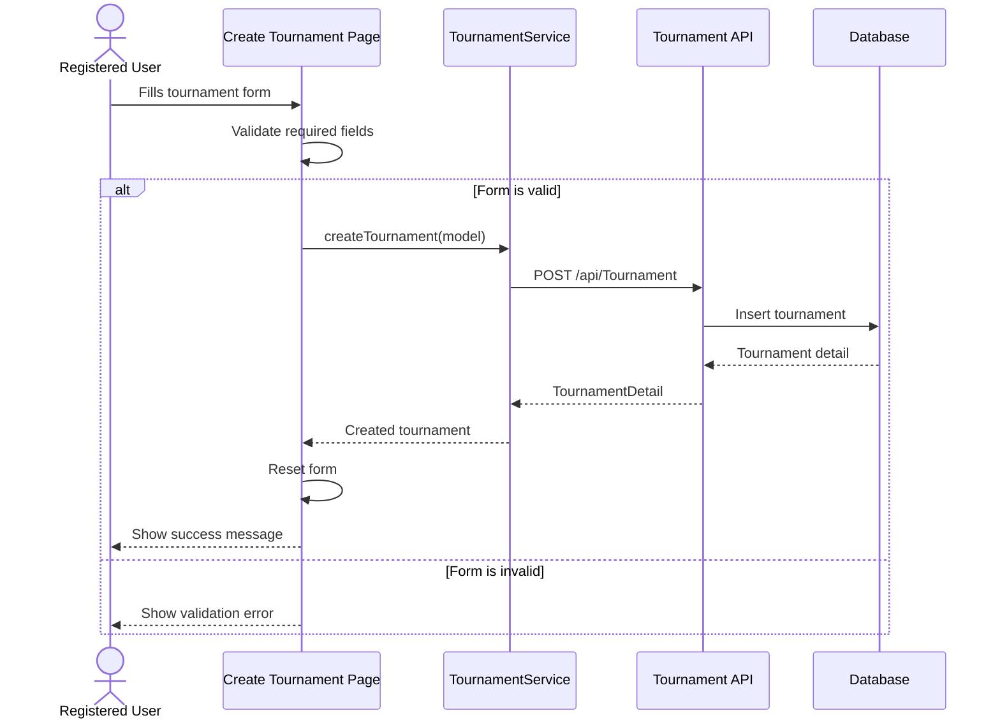
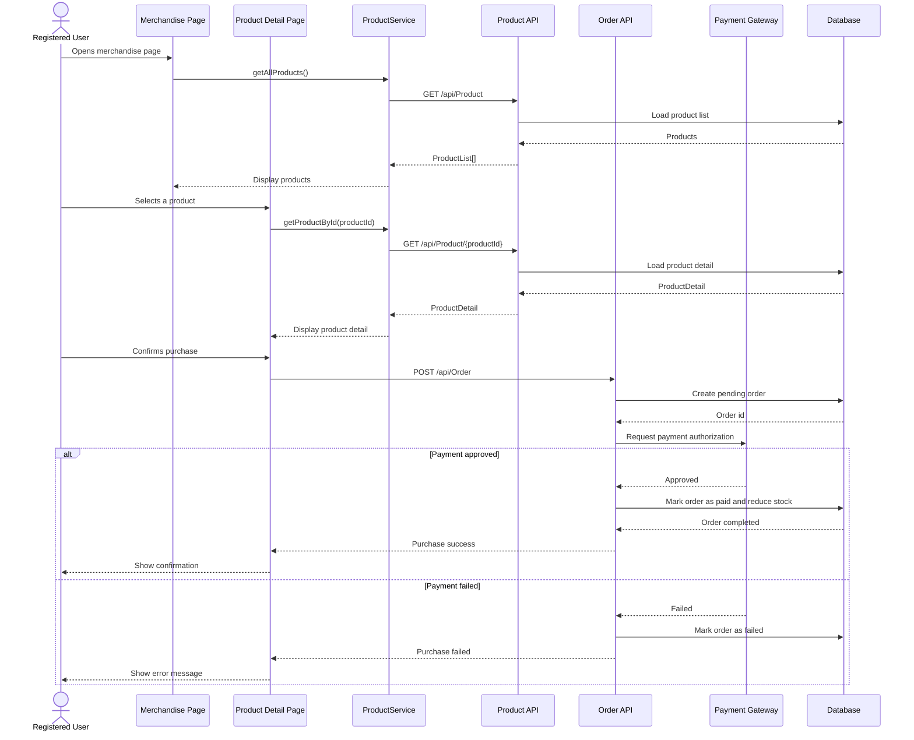

# Fanscore UML Diagrams

Bu dokuman Fanscore projesi icin istenen use case ve sequence diagramlarini icerir.

## Diyagramlari Gorsellestirme Notlari

- **Use Case Diagram** PlantUML formatindadir. Gorsellestirmek icin:
  - VS Code icinde **PlantUML** eklentisi kurulabilir.
  - Alternatif olarak kod blogu https://www.plantuml.com/plantuml/uml/ adresinde render edilebilir.
  - PlantUML kodu `@startuml` ile baslar, `@enduml` ile biter.

- **Sequence Diagram** bolumleri Mermaid formatindadir. Gorsellestirmek icin:
  - GitHub uzerinde `.md` dosyasi acildiginda Mermaid diyagramlari otomatik render edilir.
  - VS Code icinde **Markdown Preview Mermaid Support** eklentisi kullanilabilir.
  - Alternatif olarak Mermaid kodlari https://mermaid.live/ adresinde render edilebilir.
  - Mermaid kodlari `sequenceDiagram` satiri ile baslar.

## Use Case Diagram

PlantUML ile render edilebilir.

## Sequence Diagram: Register / Login

## Sequence Diagram: Rate Player

## Sequence Diagram: Create Tournament

## Sequence Diagram: Merchandise Purchase

Bu akista urun listeleme mevcut Product API ile, satin alma ise sistem tasarimi seviyesinde Order/Payment servisleri ile gosterilmistir.

